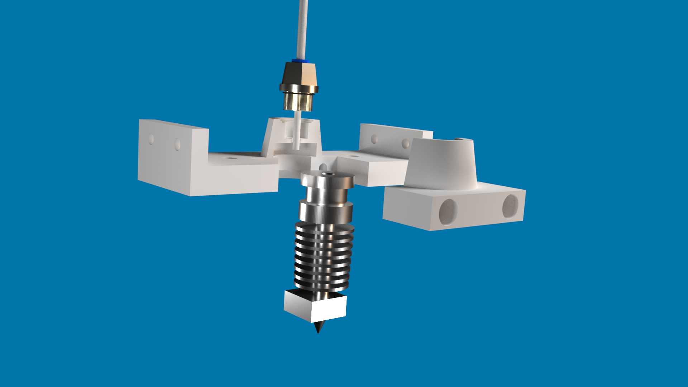

This was originaly designed as a hotend adapter for converting a direct system into bowden. I then adapted the design for a normal bowden system, you can find more about this on thingverse: https://www.thingiverse.com/thing:1697648

